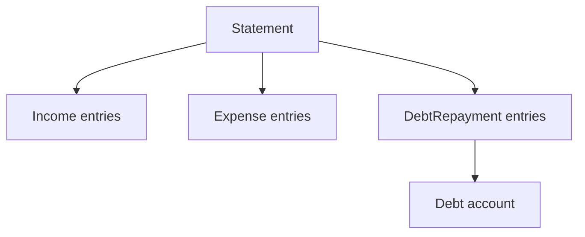

# Financial healthcheck monorepo
_Exported on 30/06/2026 at 19:03:40 BST from Cursor (3.9.8)_

---

**User**

Create a new pnpm monorepo for a project called financial-healthcheck. Use the following stack:

pnpm
Api - Node JS, express, Typescript, vitest, eslint
Static Frontend - Vite, React, Typescript, React Query, Tanstack table, shadcn, vitest, tailwind - ensure the theme uses warm colours.
Packages - shared code between services i.e. types


---

**Cursor**

Exploring the workspace to see what's already there, then drafting a monorepo setup plan.


Workspace is empty — greenfield setup. Checking one detail about where to create the project:


**Project location**

> **Your workspace is `/Users/timmy/Sites/ophelos` (empty). Where should the monorepo live?**
> - Use current workspace (ophelos folder, package name @financial-healthcheck/*) ✔
> - Create a financial-healthcheck/ subfolder inside ophelos
> - I'll open a different folder — just describe the structure (no path assumption)

Creating the monorepo plan for the empty `ophelos` workspace.


---

**User**

Implement the plan as specified, it is attached for your reference. Do NOT edit the plan file itself.

To-do's from the plan have already been created. Do not create them again. Mark them as in_progress as you work, starting with the first one. Don't stop until you have completed all the to-dos.

---

**Cursor**

Implementing the monorepo per the plan — starting with root configuration files.


Scaffolding the web app with Vite, React, Tailwind v4, and shadcn components.


Fixing TypeScript project references and adding `"type": "module"` to the root package.


Adding a build step to the shared package so the API compiles for production.


Starting dev servers to verify the API proxy works.


Ensuring dev works on a fresh clone by building shared before starting dev servers.


The **financial-healthcheck** monorepo is set up in `/Users/timmy/Sites/ophelos`. Here's what was created:

## Structure

```text
ophelos/
├── apps/api/          @financial-healthcheck/api   — Express + Vitest
├── apps/web/          @financial-healthcheck/web   — Vite + React + shadcn
└── packages/shared/   @financial-healthcheck/shared — shared types
```

## What's included

- **API** — Express on port 3001 with `GET /api/health` and `GET /api/healthcheck` (mock data), Vitest + supertest
- **Web** — Vite/React with React Query, TanStack Table, shadcn components (Button, Card, Table, Badge), warm theme (cream/terracotta palette)
- **Shared** — `HealthcheckResult`, `HealthcheckCategory`, and `API_ROUTES` types
- **Tooling** — ESLint 9 flat config, TypeScript strict mode, pnpm workspaces

## Commands

```bash
npx pnpm@9.15.9 install   # or pnpm install if corepack works
pnpm dev                  # API :3001 + Web :5173 (with /api proxy)
pnpm test                 # 3 tests passing (api + web)
pnpm lint
pnpm typecheck
pnpm build
```

## Verified

- All tests pass
- Typecheck and build succeed
- API responds at `http://localhost:3001/api/health`
- Vite proxy forwards `/api/healthcheck` correctly

**Note:** Corepack on this machine has a signature verification issue with pnpm 9.15.9. Use `npx pnpm@9.15.9 <command>` or upgrade Node to 22.12+ if Vite warns about the Node version.

---

**User**

<system_notification>
The following task has finished. If you were already aware, ignore this notification and do not restate prior responses.

<task>
kind: shell
status: aborted
task_id: 697515
title: Start api and web dev servers in parallel
output_path: /Users/timmy/.cursor/projects/Users-timmy-Sites-ophelos/terminals/697515.txt
</task>
</system_notification>
<user_query>Briefly inform the user about the task result and perform any follow-up actions (if needed). If there's no follow-ups needed, don't explicitly say that.</user_query>

---

**Cursor**

The **financial-healthcheck** monorepo is ready in `/Users/timmy/Sites/ophelos`.

You have an Express API (`apps/api`), a Vite/React frontend with a warm shadcn theme (`apps/web`), and shared types (`packages/shared`). Tests, lint, typecheck, and build all pass.

To run it:

```bash
pnpm install
pnpm dev
```

Then open `http://localhost:5173` — the web app proxies `/api` to the API on port 3001.

If `pnpm` fails via Corepack on your machine, use `npx pnpm@9.15.9` instead.

---

**User**

Add playright for E2E testing, and react testing library for the frontend components

---

**Cursor**

Checking the current test setup, then adding Playwright for E2E and confirming React Testing Library is configured.


Setting up Playwright E2E and strengthening the React Testing Library configuration.


Playwright and React Testing Library are set up. Here's what was added:

### React Testing Library (unit tests)
- Already partially in place; now includes `@testing-library/user-event`
- **`src/test/test-utils.tsx`** — `renderWithProviders` (wraps `QueryClientProvider`) and re-exports from RTL
- **`src/App.test.tsx`** — integration tests with mocked `fetch`
- Vitest limited to `src/**/*.test.{ts,tsx}` so E2E files aren't picked up

### Playwright (E2E)
- **`playwright.config.ts`** — starts API (`:3001`) and Vite (`:5173`) automatically
- **`tests/e2e/healthcheck.spec.ts`** — dashboard load + refresh flow
- Scripts:
  - `pnpm test:unit` — Vitest only
  - `pnpm test:e2e` — Playwright (root: `pnpm test:e2e`)
  - `pnpm test:e2e:ui` — Playwright UI mode

### Commands

```bash
pnpm test              # unit tests (api + web)
pnpm test:e2e          # Playwright E2E
pnpm --filter @financial-healthcheck/web test:unit
```

All 5 unit tests and 2 E2E tests pass. On first run locally, install browsers with:

```bash
cd apps/web && pnpm exec playwright install chromium
```

---

**User**

/create-rule add a new rule that is always applied for "Feature Development Workflow". This ensures development run incrementally, and following a framework of steps:
1. Schema type definitions
2. API service business logic, routes, and tests
3. Frontend components and unit testing
4. Frontend routes
5. Testing - E2E testing, and ensure api and client have required testing.

---

**Cursor**

Checking existing rules, then creating an always-applied Feature Development Workflow rule.


Created [`.cursor/rules/feature-development-workflow.mdc`](.cursor/rules/feature-development-workflow.mdc) with `alwaysApply: true`.

It enforces the 5-step incremental workflow mapped to this monorepo:

1. **Schema types** → `packages/shared`
2. **API logic, routes, tests** → `apps/api/src/services/`, `routes/`, Vitest + supertest
3. **Frontend components + unit tests** → `apps/web/src/components/`, React Testing Library via `test-utils.tsx`
4. **Frontend routes** → `apps/web/src/pages/` wired in `App.tsx`
5. **Testing** → API unit tests, client unit tests, Playwright E2E in `tests/e2e/`

This rule will apply automatically to every session in this project.

---

**User**

Add a readme

---

**Cursor**

Reviewing the project structure to write an accurate README.


Added [`README.md`](README.md) at the repo root. It covers the stack, project layout, setup (`pnpm install` / `pnpm dev`), available scripts, API endpoints, the incremental feature workflow, and how testing is organized across the API, unit, and E2E layers.

---

**User**

Reset the frontend app back to an empty view as a starting point for the app.

---

**Cursor**

Resetting the frontend to a minimal starting point. Reviewing current files and their tests.


The frontend is reset to a minimal starting point.

**`App.tsx`** — empty shell with a full-height background and an empty `<main>`.

**Removed** — `HealthcheckTable`, `lib/api.ts`, and the healthcheck-specific E2E spec.

**Kept** — React Query provider in `main.tsx`, shadcn UI primitives, Tailwind theme, and `test-utils.tsx` for when you add components.

**Tests updated** — unit and E2E specs now assert the empty shell renders. All tests pass.

---

**User**

Let's start by adding a basic User schema, this will just be their name and be stored in-memory for the current client.

---

**Cursor**

Reviewing the codebase to plan the User schema and in-memory client storage.


Confirming client-side in-memory storage (no API). Creating the plan.


> **Beyond the User type and in-memory state, should this slice include minimal UI to set and display the name (e.g. a name input + greeting), or only the schema and client state layer with no visible UI yet?**
> - Include minimal UI (input to set name, display greeting)
> - Schema + state layer only — no UI yet ✔

---

**User**

Implement the plan as specified, it is attached for your reference. Do NOT edit the plan file itself.

To-do's from the plan have already been created. Do not create them again. Mark them as in_progress as you work, starting with the first one. Don't stop until you have completed all the to-dos.

---

**Cursor**

Implementing the User schema and client-side in-memory state per the plan.


User schema and client-side in-memory state are in place.

### Shared type
- [`packages/shared/src/types/user.ts`](packages/shared/src/types/user.ts) — `User` with `name: string`
- Exported from [`packages/shared/src/index.ts`](packages/shared/src/index.ts)

### Client state
- [`apps/web/src/contexts/UserProvider.tsx`](apps/web/src/contexts/UserProvider.tsx) — `useUser()` returns `{ user, setUser, clearUser }`
- Wired in [`main.tsx`](apps/web/src/main.tsx) and [`test-utils.tsx`](apps/web/src/test/test-utils.tsx)

### Tests
- 4 context tests (default `null`, `setUser`, `clearUser`, provider guard)
- All typechecks and unit tests pass

`App.tsx` is still an empty shell — no UI yet. User state lives in memory only and is cleared on refresh. Use `useUser()` when you add components.

---

**User**

Show a full screen 'onboarding' view on the UI that asks 'What shall we call you?' with an input for their name. Use this name where applicable going forwards. To start, add a basic greeting on the homepage.

---

**Cursor**

Reviewing the current User setup and frontend structure to plan the onboarding flow.


User schema and `UserProvider` are in place. Planning the onboarding UI and homepage greeting.


---

**User**

Implement the plan as specified, it is attached for your reference. Do NOT edit the plan file itself.

To-do's from the plan have already been created. Do not create them again. Mark them as in_progress as you work, starting with the first one. Don't stop until you have completed all the to-dos.

---

**Cursor**

Implementing the onboarding view and homepage greeting per the plan.


Fixing HomePage tests and completing the remaining test files.


Onboarding and the homepage greeting are in place.

### What was added

- **`OnboardingView`** — full-screen view with “What shall we call you?”, name input, and Continue (disabled when empty; trims whitespace; Enter submits)
- **`HomePage`** — shows `Hello, {name}` using `useUser()`
- **`App`** — shows onboarding when `user` is null, homepage when set
- **`Input`** — shadcn input component for the name field

### Flow

1. First visit → onboarding screen
2. Enter name and click Continue → name stored in `UserProvider`
3. Homepage → `Hello, Alex` (or whatever name was entered)

State is still in-memory only (cleared on refresh). All 10 unit tests and the E2E onboarding test pass.

---

**User**

Starting with step 1. Schema type definitions, start the process of creating a financial tracker to manage income, expenses and dept repayments.

---

**Cursor**

Reviewing existing shared types and workflow to recommend schema definitions for the financial tracker.


You're on **step 1 only** — schema types in `packages/shared`. I'm in **Ask mode**, so I can't edit files; switch to **Agent mode** if you want this implemented. Below is a concrete starting schema aligned with your workflow and existing patterns (`id`, ISO `date`/`createdAt` strings).

## Recommended file layout

```
packages/shared/src/types/
├── money.ts           # shared value object
├── income.ts
├── expense.ts
├── debt.ts
├── debt-repayment.ts
└── finance.ts         # optional: unions + summary types
```

Export everything from [`packages/shared/src/index.ts`](packages/shared/src/index.ts), then rebuild:

```bash
pnpm --filter @financial-healthcheck/shared build
```

## Core design decisions

**1. Money as minor units (pence/cents)**  
Avoid `float` for currency. Store integers in the smallest unit:

```ts
export interface Money {
  amount: number;   // e.g. 1250 = £12.50
  currency: "GBP";  // start with one currency; widen later
}
```

**2. Three entry types, not one generic "transaction"**  
Income, expenses, and debt repayments behave differently (repayments link to a debt). Separate types keep step 2 API logic clearer.

**3. Debt as its own entity**  
Repayments reference a `debtId` so you can track balance over time.

---

## Proposed types

### `money.ts`

```ts
export type CurrencyCode = "GBP";

export interface Money {
  amount: number;
  currency: CurrencyCode;
}
```

### `income.ts`

```ts
import type { Money } from "./money.js";

export interface Income {
  id: string;
  amount: Money;
  description: string;
  date: string;       // ISO date, e.g. "2026-06-30"
  createdAt: string;  // ISO datetime
}
```

### `expense.ts`

```ts
import type { Money } from "./money.js";

export type ExpenseCategory =
  | "housing"
  | "food"
  | "transport"
  | "utilities"
  | "other";

export interface Expense {
  id: string;
  amount: Money;
  description: string;
  category: ExpenseCategory;
  date: string;
  createdAt: string;
}
```

### `debt.ts`

```ts
import type { Money } from "./money.js";

export interface Debt {
  id: string;
  name: string;
  balance: Money;     // amount still owed
  createdAt: string;
}
```

### `debt-repayment.ts`

```ts
import type { Money } from "./money.js";

export interface DebtRepayment {
  id: string;
  debtId: string;
  amount: Money;
  date: string;
  createdAt: string;
}
```

### `finance.ts` (summary — useful for step 2 API responses)

```ts
import type { Debt } from "./debt.js";
import type { DebtRepayment } from "./debt-repayment.js";
import type { Expense } from "./expense.js";
import type { Income } from "./income.js";
import type { Money } from "./money.js";

export interface FinanceSummary {
  totalIncome: Money;
  totalExpenses: Money;
  totalDebtRepayments: Money;
  netPosition: Money;   // income - expenses - repayments
}

export interface FinanceLedger {
  incomes: Income[];
  expenses: Expense[];
  debts: Debt[];
  debtRepayments: DebtRepayment[];
  summary: FinanceSummary;
}
```

### Future API route constants (add when you reach step 2)

```ts
export const FINANCE_API_ROUTES = {
  incomes: "/api/finance/incomes",
  expenses: "/api/finance/expenses",
  debts: "/api/finance/debts",
  debtRepayments: "/api/finance/debt-repayments",
  summary: "/api/finance/summary",
} as const;
```

---

## How this fits your app today

| Existing | Relationship |
|----------|--------------|
| [`User`](packages/shared/src/types/user.ts) | Client-only for now; finance data can stay per-session in-memory initially (like User) or move to API in step 2 |
| [`healthcheck.ts`](packages/shared/src/types/healthcheck.ts) | Legacy scaffold; safe to leave until you replace/remove the healthcheck API |

---

## Suggested step 1 checklist

- [ ] Add the type files above under `packages/shared/src/types/`
- [ ] Export all types from `packages/shared/src/index.ts`
- [ ] Run `pnpm --filter @financial-healthcheck/shared typecheck`
- [ ] Run `pnpm --filter @financial-healthcheck/shared build`
- [ ] **Stop** — no API, UI, or tests yet (that's steps 2–5)

---

## What step 2 will look like next

Once types are in place:

- `apps/api/src/services/finance.service.ts` — in-memory stores for incomes, expenses, debts, repayments
- Routes for CRUD + `GET /api/finance/summary`
- Supertest tests validating types and summary math

---

## Open choices (decide before Agent implements)

1. **Storage for step 2** — in-memory on the API (like a real backend stub) vs client-only (like `User`)? For a "tracker", API in-memory is the natural next step.
2. **Expense categories** — fixed list above, or free-text?
3. **Debt balance** — computed from repayments, or manually updated when recording a repayment?

If you want me to implement step 1, switch to **Agent mode** and say whether you prefer API in-memory storage in step 2 or client-only for now.

---

**User**

The top level interface should be called statement, and applies to a single month and year.

---

**Cursor**

Updating the schema design so `Statement` is the top-level container for a single month/year.


With `Statement` as the top-level type, the model becomes **period-centric**: each statement is one calendar month, and income, expenses, and debt repayments belong to that period.

## Revised hierarchy



`Debt` is a **long-lived account** (e.g. "Credit card", "Student loan"). `DebtRepayment` entries live **on a statement** and reference a debt.

---

## `statement.ts` — top-level interface

```ts
import type { DebtRepayment } from "./debt-repayment.js";
import type { Expense } from "./expense.js";
import type { Income } from "./income.js";
import type { Money } from "./money.js";

export interface StatementPeriod {
  month: number;  // 1–12
  year: number;   // e.g. 2026
}

export interface StatementSummary {
  totalIncome: Money;
  totalExpenses: Money;
  totalDebtRepayments: Money;
  netPosition: Money;
}

export interface Statement {
  id: string;
  period: StatementPeriod;
  incomes: Income[];
  expenses: Expense[];
  debtRepayments: DebtRepayment[];
  summary: StatementSummary;
  createdAt: string;
  updatedAt: string;
}
```

`month` + `year` on `Statement` define the period. Line items use `date` within that month for ordering/display, but the statement is the boundary.

---

## Supporting types (unchanged intent, small tweaks)

### `money.ts`
```ts
export type CurrencyCode = "GBP";

export interface Money {
  amount: number;   // minor units (pence)
  currency: CurrencyCode;
}
```

### `income.ts` / `expense.ts` / `debt-repayment.ts`
Each line item references its statement:

```ts
export interface Income {
  id: string;
  statementId: string;
  amount: Money;
  description: string;
  date: string;
  createdAt: string;
}
```

Same pattern for `Expense` and `DebtRepayment` (`statementId: string`).

### `debt.ts` — not tied to a single month
```ts
export interface Debt {
  id: string;
  name: string;
  balance: Money;
  createdAt: string;
}
```

`DebtRepayment` links both:

```ts
export interface DebtRepayment {
  id: string;
  statementId: string;
  debtId: string;
  amount: Money;
  date: string;
  createdAt: string;
}
```

---

## Optional helper type

For listing statements without full line-item detail:

```ts
export interface StatementMeta {
  id: string;
  period: StatementPeriod;
  summary: StatementSummary;
  updatedAt: string;
}
```

---

## File layout

```
packages/shared/src/types/
├── money.ts
├── debt.ts
├── income.ts
├── expense.ts
├── debt-repayment.ts
└── statement.ts    ← top-level
```

Export from `index.ts`:

```ts
export type { Statement, StatementPeriod, StatementSummary, StatementMeta } from "./types/statement.js";
// ...other exports
```

---

## Design notes

| Topic | Recommendation |
|-------|----------------|
| **Uniqueness** | One statement per `(month, year)` — enforce in step 2 service layer |
| **Summary** | Computed from line items when building/fetching a statement, not stored independently at first |
| **Dates on line items** | `date` should fall within the statement's month/year (validate in API step 2) |
| **User** | Statements can stay user-scoped later; not required on the type for step 1 if still single-user/in-memory |

---

## Step 1 scope (schema only)

1. Add the files above with `Statement` as the aggregate root  
2. Export from `packages/shared/src/index.ts`  
3. `pnpm --filter @financial-healthcheck/shared build`  

No API or UI yet.

Switch to **Agent mode** if you want this implemented in the repo.

---

**User**

Implement step 1

---

**Cursor**

Implementing step 1: shared schema types with `Statement` as the top-level interface.


Step 1 is done. Shared finance types are in `packages/shared/src/types/`:

| File | Types |
|------|-------|
| `money.ts` | `Money`, `CurrencyCode` |
| `debt.ts` | `Debt` |
| `income.ts` | `Income` |
| `expense.ts` | `Expense`, `ExpenseCategory` |
| `debt-repayment.ts` | `DebtRepayment` |
| `statement.ts` | `Statement`, `StatementPeriod`, `StatementSummary`, `StatementMeta` |

**`Statement`** is the top-level type for one month/year (`period.month`, `period.year`) and holds `incomes`, `expenses`, `debtRepayments`, and a computed `summary`. Line items reference their statement via `statementId`; repayments also reference `debtId`.

All types are exported from `packages/shared/src/index.ts`. Typecheck and build pass.

Ready for step 2 (API service + routes) when you are.

---

**User**

Add clear comment descriptions alongside each of these types

---

**Cursor**

Adding JSDoc descriptions to all finance schema types and their fields.


Added JSDoc comments to all finance schema types and `User`:

- **Type-level** — what each interface/type represents (e.g. `Statement` as the top-level monthly record, `Debt` as a long-lived account)
- **Field-level** — where useful (`amount` in minor units, `month` 1–12, ISO date format, foreign key relationships)

Comments are in:
- `money.ts`, `debt.ts`, `income.ts`, `expense.ts`, `debt-repayment.ts`, `statement.ts`, `user.ts`

---

**User**

@packages/shared/src/types/statement.ts:11-18 Review and comment

---

**Cursor**

Reviewing the unified `Payment` model and adding JSDoc comments. Fixing `index.ts` exports to match the simplified schema.


**Review**

The unified `Payment` model is a solid simplification — one `payments[]` on `Statement` instead of three parallel arrays keeps the schema lean and makes monthly totals straightforward to compute.

**Strengths**
- `type` discriminator cleanly covers all three movement kinds
- `statementId` correctly scopes line items to a period
- `amount` + `date` are the right core fields

**Gaps to consider before step 2**

| Field | Issue |
|-------|--------|
| `description` | No label for what the payment was (e.g. "Salary", "Rent") — you'll likely want this for UI |
| `debtId` | When `type` is `"debtRepayment"`, there's no link to which debt account is being paid |
| `category` | Expenses previously had categories (`housing`, `food`, etc.) — lost with unification |
| Summary | `Statement` no longer carries totals — the API will need to derive `totalIncome`, `netPosition`, etc. from `payments` |

For type-specific fields, a **discriminated union** works well later:

```ts
type Payment =
  | { type: "income"; ... }
  | { type: "expense"; category: ExpenseCategory; ... }
  | { type: "debtRepayment"; debtId: string; ... }
```

**Comments added** — JSDoc on `Payment`, extracted `PaymentType`, and field-level notes on `statementId`, `type`, and `date`. Also synced `index.ts` exports with the current schema.

---

**User**

Now the model is defined, let's plan step 2

---

**Cursor**

Reviewing the current schema and API structure to plan step 2.


Schema and API patterns are clear. Creating the step 2 plan.


---

**User**

Focus specifically on the create statement post endpoint. The statement is tied to a specific user, ensure the api accepts the id alongside other payload data when creating a new statement.

---

**Cursor**

Reviewing the plan and schema to incorporate user-scoped statement creation.


Noting `Statement.userId` and `User.id` are already in the schema. Updating the plan to focus on the user-scoped create-statement POST endpoint.


Updated the step 2 plan to center on **user-scoped statement creation**. Main changes:

### Focus
This slice implements only **`POST /api/statements`**. List, get, and payment routes are listed as follow-ups within step 2.

### Request payload
```ts
{ userId: string, month: number, year: number }
```
Shared type: `CreateStatementInput` — aligns with `Statement.userId` already on the schema.

### Uniqueness
One statement per **`(userId, month, year)`**, not per period globally. Two users can both have a June 2026 statement.

### Service
- Period index key: `"${userId}:${year}:${month}"`
- `createStatement` stores `userId` on the statement and returns `StatementWithSummary` with an empty payments array and zero summary

### Validation
- `userId` — required non-empty string (no user registry lookup yet)
- `month` — 1–12, `year` — 2000–2100

### Tests
- Create succeeds with `userId` in response
- Duplicate user + period → `409`
- Same period, different `userId` → `201`
- Missing/invalid fields → `400`

Confirm the plan when you want this implemented, or say what to adjust.

---

**User**

Implement the plan as specified, it is attached for your reference. Do NOT edit the plan file itself.

To-do's from the plan have already been created. Do not create them again. Mark them as in_progress as you work, starting with the first one. Don't stop until you have completed all the to-dos.

---

**Cursor**

Implementing the user-scoped create-statement API per the plan.


Fixing route tests to avoid singleton state collisions between test cases.


Step 2 (create statement) is implemented. Summary:

### Shared types
- `CreateStatementInput`, `StatementSummary`, `StatementWithSummary`, `STATEMENT_API_ROUTES`
- Exported from `packages/shared/src/index.ts`

### API
- **`POST /api/statements`** — body: `{ userId, month, year }`
- Returns `201` with `StatementWithSummary` (empty `payments`, zero summary)
- `409` if a statement already exists for that user + period
- `400` on validation errors

### Files added
- `apps/api/src/lib/summary.ts` — `computeSummary()`
- `apps/api/src/lib/validation.ts` — zod schema
- `apps/api/src/services/statements.service.ts` — in-memory store with user-scoped period index
- `apps/api/src/routes/statements.ts` — route handler
- Unit + route tests (10 API tests passing)

### Example request
```bash
curl -X POST http://localhost:3001/api/statements \
  -H "Content-Type: application/json" \
  -d '{"userId":"user-1","month":6,"year":2026}'
```

---

**User**

Add a get request that lists out all the statements relating to the current user.

---

**Cursor**

Reviewing the statements API implementation to plan the user-scoped list endpoint.


Confirming POST uses `userId` in the body; there's no auth layer. Planning `GET /api/statements?userId=` to match that pattern.


---

**User**

Implement the plan as specified, it is attached for your reference. Do NOT edit the plan file itself.

To-do's from the plan have already been created. Do not create them again. Mark them as in_progress as you work, starting with the first one. Don't stop until you have completed all the to-dos.

---

**Cursor**

Implementing the GET list-statements endpoint per the plan.


Implemented `GET /api/statements?userId=` to list all statements for a user.

### Endpoint
```
GET /api/statements?userId=<id>
→ 200 StatementWithSummary[]  (empty array if none)
→ 400 if userId missing
```

Results are sorted newest period first (year desc, then month desc), each with a computed `summary`.

### Changes
- **`listStatementsByUserId`** in `statements.service.ts`
- **`listStatementsQuerySchema`** in `validation.ts`
- **GET handler** on `statementsRouter`
- **`ListStatementsQuery`** type in shared
- 6 service tests + 4 route tests added (17 API tests passing)

### Example
```bash
curl "http://localhost:3001/api/statements?userId=user-1"
```

---

**User**

Use browser localstorage to manage the current user data (including ID).

---

**Cursor**

Implementing localStorage persistence for user data, including ID generation on `setUser`.


User data is now persisted in `localStorage`, including a stable ID.

### Changes

**`apps/web/src/lib/user-storage.ts`** — load, save, and clear user under key `financial-healthcheck:user`, with validation of stored shape.

**`UserProvider`** — on mount reads from `localStorage`; `setUser(name)` creates `{ id: crypto.randomUUID(), name }` and saves it; `clearUser()` removes it from storage and state.

### Behaviour

- **First visit** → onboarding → user saved with generated `id` + `name`
- **Refresh** → user restored from `localStorage`, skips onboarding
- **`clearUser()`** → wipes storage and resets state

All 15 web unit tests pass. The `user.id` is ready to pass to `GET /api/statements?userId=` when you wire the frontend API.

---

**User**

The homepage of the app should be called "dashboard" and only show after the user has completed onboarding. The dashboard should request for 'statements' relating to the current user.

---

**Cursor**

Reviewing the frontend and API setup to plan the dashboard and statements fetch.


Confirming onboarding gating via `user` in localStorage. Planning the Dashboard rename and statements fetch.


---

**User**

Implement the plan as specified, it is attached for your reference. Do NOT edit the plan file itself.

To-do's from the plan have already been created. Do not create them again. Mark them as in_progress as you work, starting with the first one. Don't stop until you have completed all the to-dos.

---

**Cursor**

Implementing the Dashboard with user statements per the plan.


The Dashboard with user statements is implemented.

### What changed

- **`HomePage` → `Dashboard`** — post-onboarding view with a "Dashboard" heading and `Hello, {name}` greeting
- **`lib/api.ts`** — `fetchStatements(userId)` calls `GET /api/statements?userId=`
- **`lib/format-money.ts`** — formats minor units as GBP (e.g. `£500.00`)
- **React Query** — fetches statements using `user.id` from localStorage

### UI states

| State | Copy |
|-------|------|
| Loading | "Loading statements…" |
| Empty | "No statements yet" |
| Error | Retry button |
| Data | Table: Period + Net position |

### Flow

1. No user → onboarding  
2. User completes onboarding (saved to localStorage with `id`) → Dashboard  
3. Dashboard fetches statements for `user.id`

All 19 unit tests and the E2E onboarding → dashboard flow pass.

---

**User**

@.cursor/rules/frontend-components.mdc:1-284 Rewrite this rule to align with the current project, focusing only on /web for frontend react components

---

**Cursor**

Reviewing the web app structure and conventions to rewrite the frontend-components rule.


Rewrote [`.cursor/rules/frontend-components.mdc`](.cursor/rules/frontend-components.mdc) for this project’s web app only. Summary of changes:

### Removed
- Mobile / Expo Router references
- Lingobloom / Next.js-specific paths
- Mandatory folder-per-component layout (kept as a growth path, not the current default)
- react-hook-form requirements for all forms (onboarding-style single-field flows can stay simple)

### Aligned with `apps/web`
- **Paths**: `components/`, `components/ui/`, `contexts/`, `lib/`, `test/`, `pages/` (optional)
- **Stack**: Vite, React Query, shadcn, Tailwind warm theme, TanStack Table
- **Shared types**: `@financial-healthcheck/shared`
- **API**: `lib/api.ts` + Vite `/api` proxy
- **User state**: `UserProvider` + `user-storage` (localStorage with `user.id`)
- **Tests**: `renderWithProviders`, fetch mocks, Playwright E2E
- **Globs**: `apps/web/**/*.{ts,tsx}` only

The rule stays under 50 lines of substantive guidance and matches how `Dashboard`, `OnboardingView`, and `App.tsx` are structured today.

---

**User**

When the dashboard is loading, show a full page spinner/loader. If no statements are returned from the backend, show a centered "Start financial health check" button. Add sub header text below this main cta explaining that this will help them better understand their financial health and manage their way out of debt.

---

**Cursor**

Reviewing the Dashboard and available UI components to plan the loading and empty states.


One detail: what should the CTA do when clicked? Checking whether a healthcheck flow exists.


No healthcheck flow exists yet — planning the CTA as presentational for now.


> **What should "Start financial health check" do when clicked?**
> - Presentational only for now (no navigation — wire up healthcheck flow later)
> - On click: create a statement for the current month via POST /api/statements
>
> Answer: This will take them to the /statement/new page (TBC). Use react-router to navigate.

Checking routing setup and whether React Router is installed.


---

**User**

Implement the plan as specified, it is attached for your reference. Do NOT edit the plan file itself.

To-do's from the plan have already been created. Do not create them again. Mark them as in_progress as you work, starting with the first one. Don't stop until you have completed all the to-dos.

---

**Cursor**

Implementing the plan: starting with React Router setup, then the spinner, Dashboard states, and tests.


Fixing the test that asserted the dashboard heading before loading finished.


All planned changes are in place. Summary:

### Loading state
- [`Dashboard.tsx`](apps/web/src/components/Dashboard.tsx) returns `<FullPageLoader />` while statements load — full viewport, no header.
- [`spinner.tsx`](apps/web/src/components/ui/spinner.tsx) provides `Spinner` (`Loader2` + `animate-spin`, `role="status"`) and `FullPageLoader`.

### Empty state
- Centered **Start financial health check** button with subheader: *"This will help you better understand your financial health and manage your way out of debt."*
- Button navigates to `/statement/new` via `useNavigate()`.

### Routing
- Added `react-router-dom`.
- `BrowserRouter` in [`main.tsx`](apps/web/src/main.tsx).
- Authenticated routes in [`App.tsx`](apps/web/src/App.tsx): `/` → Dashboard, `/statement/new` → placeholder [`StatementNewPage.tsx`](apps/web/src/pages/StatementNewPage.tsx).

### Tests
- `MemoryRouter` in [`test-utils.tsx`](apps/web/src/test/test-utils.tsx).
- Dashboard tests cover loader, empty CTA, navigation, and existing cases.
- E2E tests assert the new empty state and CTA navigation.

**Verification:** 21 unit tests and 2 E2E tests passing; typecheck clean.

---

**User**

This start financial health check button should be centered on the screen with no other dashboard elements (or title) showing.

---

**Cursor**

Updating the empty state to a full-screen centered CTA with no dashboard chrome, and adjusting tests.


Removing the duplicate empty-state test.


The empty state is now a full-screen view with only the CTA and subheader — no dashboard title, greeting, or other chrome.

When there are no statements, `Dashboard` early-returns a centered layout (`min-h-screen flex-col items-center justify-center`), matching the loading spinner pattern. The dashboard header and statements table only render when statements exist (or on error).

Tests were updated to assert the dashboard heading is hidden in the empty state and visible when statements are present. All 20 unit tests and 2 E2E tests pass.

---

**User**

@apps/web/src/pages/StatementNewPage.tsx This new page should specific be for allowing users to add new statements. Create a form on this page with a submit button. Manage the form state with react hook form and zod for schema validation.

Add separate ui payment groupings for 'Monthly income', 'Monthly esstential costs' and 'Debt and financial commitments'. Users can add as many payment items as they need to each of these groupings. Atleast 1 payment item is required for each for the form to be valid.

Upon clicking submit, the post request payload is sent to the api and the user is redirected to a separate /statement/:id page (TBC).

---

**Cursor**

Reviewing statement types, API routes, and the current new-statement page to draft the form plan.


One clarification before finalizing the plan: how should we handle the statement period?


> **Each statement is tied to a month/year. How should the new-statement form handle the period?**
> - Default to the current calendar month/year (no period fields on the form)
> - Let the user pick month and year on the form
>
> Answer: Let the user pick the current month and year, or past month and year. Default to current.

---

**User**

Implement the plan as specified, it is attached for your reference. Do NOT edit the plan file itself.

To-do's from the plan have already been created. Do not create them again. Mark them as in_progress as you work, starting with the first one. Don't stop until you have completed all the to-dos.

---

**Cursor**

Implementing the plan step by step, starting with shared types and API changes.


All planned work is complete. Summary:

### Shared + API
- Added `CreatePaymentInput` and extended `CreateStatementInput` with a required `payments` array
- `POST /api/statements` now persists payments, defaults missing dates to the first of the statement month, and validates at least one payment per type (`income`, `expense`, `debtRepayment`)

### New statement form (`/statement/new`)
- **react-hook-form** + **Zod** via `statement-new.schema.ts`
- Month/year selectors (default: current period; past 5 years available)
- Three payment groups with add/remove rows:
  - Monthly income
  - Monthly essential costs
  - Debt and financial commitments
- Each group requires at least one valid item (label + positive amount in £)
- Submit calls `createStatement`, invalidates the statements query, and redirects to `/statement/:id`
- Shows an inline error on duplicate period (409)

### Routes
- `/statement/:id` → placeholder `StatementDetailPage` (shows statement ID)

### Tests
- 20 API tests, 23 web unit tests, 3 E2E tests — all passing

Key files:
- [`apps/web/src/pages/StatementNewPage/StatementNewPage.tsx`](apps/web/src/pages/StatementNewPage/StatementNewPage.tsx)
- [`apps/web/src/pages/StatementNewPage/components/PaymentGroup/PaymentGroup.tsx`](apps/web/src/pages/StatementNewPage/components/PaymentGroup/PaymentGroup.tsx)
- [`apps/web/src/pages/StatementDetailPage.tsx`](apps/web/src/pages/StatementDetailPage.tsx)

---

**User**

Add a 'Use sample data' button next to the submit button. This will submit the form with stubbed data.

---

**Cursor**

Adding sample data to the schema and a button that submits it directly.


Added a **Use sample data** button beside **Submit statement**. Clicking it submits stubbed values without filling the form manually:

- **Income:** Salary — £2,500  
- **Essential costs:** Rent — £900, Utilities — £150  
- **Debt:** Credit card — £200  
- **Period:** current month and year

Sample values live in `getSampleStatementNewValues()` in [`statement-new.schema.ts`](apps/web/src/pages/StatementNewPage/statement-new.schema.ts). The button uses the same submit path as the main form (API POST + redirect to `/statement/:id`). Both buttons are disabled while a submission is in progress.

---

**User**

Add a new Statement Status type that will be calculated on the fly based on the netposition value calculated @packages/shared/src/types/statement.ts:76.

This status can be one of:
Breathing room
Tight
At risk
Deficit
Needs review

---

**Cursor**

Reviewing how net position is computed and where summaries are used so we can plan the status type.


Threshold rules aren't defined yet — net position alone can be absolute pence or a share of income, and "Needs review" may be a separate edge case.


> **How should status be derived from net position?**
> - As a % of total income (e.g. Breathing room ≥15%, Tight 5–15%, At risk 0–5%, Deficit <0; Needs review when income is £0)
> - Fixed GBP thresholds on net position only (you’ll specify amounts) ✔
> - Use sensible %‑of‑income defaults (as in first option) — I’ll refine later

> **Where should status be included?**
> - Add status to StatementSummary on API responses (computed server-side, shared helper in packages/shared) ✔
> - Shared type + pure helper only for now (no API/UI wiring yet)

> **What GBP boundaries (monthly net position) should map to each status?**
> - Use proposed defaults: Deficit <£0 | At risk £0–£99 | Tight £100–£299 | Breathing room ≥£300 | Needs review when total income is £0 ✔
> - I’ll specify custom GBP boundaries in a follow-up message

---

**User**

Implement the plan as specified, it is attached for your reference. Do NOT edit the plan file itself.

To-do's from the plan have already been created. Do not create them again. Mark them as in_progress as you work, starting with the first one. Don't stop until you have completed all the to-dos.

---

**Cursor**

Implemented. Summary:

### Shared (`packages/shared`)
- Added `StatementStatus`: `breathingRoom` | `tight` | `atRisk` | `deficit` | `needsReview`
- Added `status` to `StatementSummary`
- Added [`statement-status.ts`](packages/shared/src/lib/statement-status.ts) with `computeStatementStatus()` and threshold constants:
  - **Needs review** — `totalIncome === 0`
  - **Deficit** — net &lt; £0
  - **At risk** — £0–£99.99
  - **Tight** — £100–£299.99
  - **Breathing room** — £300+

### API
- [`computeSummary`](apps/api/src/lib/summary.ts) now sets `status` on every summary returned from statement endpoints

### Tests
- New [`summary.test.ts`](apps/api/src/lib/summary.test.ts) — status bands, boundaries, and summary integration
- Updated service and route tests to expect `status: "breathingRoom"` for the sample data (net £1,100)

32 API tests passing; web typecheck clean. Status is computed on the fly and included in API responses — no UI changes yet.

---

**User**

Based on this status, also add a deterministic function to return a "repayment guidance" string, and a "why am i seeing this string". These should be calculated on the statement service and enriched in the data provided to the client.

---

**Cursor**

Reviewing the statement status implementation and API response shape to plan repayment guidance enrichment.


Checking DECISIONS for tone and whether guidance fields exist elsewhere.


Enrichment belongs in the statements service; guidance logic will live in shared pure functions keyed by status.


> **Where should the two strings live on API responses?**
> - Add repaymentGuidance and whyAmISeeingThis on StatementSummary (alongside status) ✔
> - Add a separate guidance object on StatementWithSummary (sibling to summary)

---

**User**

Implement the plan as specified, it is attached for your reference. Do NOT edit the plan file itself.

To-do's from the plan have already been created. Do not create them again. Mark them as in_progress as you work, starting with the first one. Don't stop until you have completed all the to-dos.

---

**Cursor**

Implemented. Summary:

### Shared
- Extended `StatementSummary` with `repaymentGuidance` and `whyAmISeeingThis`
- Added `StatementSummaryBase` for totals + status (before enrichment)
- New [`repayment-guidance.ts`](packages/shared/src/lib/repayment-guidance.ts):
  - `computeRepaymentGuidance(status)` — status-based guidance copy
  - `computeWhyAmISeeingThis({ status, netPosition, totalIncome })` — explanation with formatted net position

### API
- [`computeSummary`](apps/api/src/lib/summary.ts) still returns totals + status only (`StatementSummaryBase`)
- [`statements.service.ts`](apps/api/src/services/statements.service.ts) adds `enrichSummary()` and uses it for create + list responses

### Tests
- New [`repayment-guidance.test.ts`](apps/api/src/lib/repayment-guidance.test.ts) — all five statuses with exact copy
- Updated service and route tests for enriched `summary`

43 API tests passing; web typecheck clean. Clients now receive both strings on every `StatementWithSummary` response.

---

**User**

Add a new API endpoint to fetch a single statement by id

---

**Cursor**

Reviewing the statements API structure, then adding GET by id.


Implementing the service method, route, validation, and tests.


Added `GET /api/statements/:id` to fetch a single statement with its enriched summary.

### API
- **`getStatementById(id)`** in [`statements.service.ts`](apps/api/src/services/statements.service.ts) — returns `StatementWithSummary` or `undefined`
- **`GET /:id`** in [`statements.ts`](apps/api/src/routes/statements.ts) — `200` with the statement, `404` if not found, `400` for invalid id
- **`statementIdParamsSchema`** in [`validation.ts`](apps/api/src/lib/validation.ts)
- Refactored **`toStatementWithSummary`** so create, list, and get-by-id share the same enrichment path

### Web client
- **`fetchStatement(id)`** in [`api.ts`](apps/web/src/lib/api.ts) using the existing `STATEMENT_API_ROUTES.statementById` helper

### Tests
- Service: get by id + unknown id cases
- Routes: `200` with full summary and `404` for missing statement

47 API tests passing.

---

**User**

Upon mounting the @apps/web/src/pages/StatementDetailPage.tsx , fetch the corresponding statement and render:

Total monthly income, expenses, repayments, and "money left".

Add a two items below for "Suggested repayment guidance" and "Why am I seeing this?"

Add a button to route back to the homepage.

---

**Cursor**

Implementing StatementDetailPage with fetch, summary display, and tests.


Updating StatementNewPage tests to mock the detail-page fetch after navigation.


Implemented [`StatementDetailPage.tsx`](apps/web/src/pages/StatementDetailPage.tsx):

### Data loading
- Uses React Query with `fetchStatement(id)` on mount
- Full-page loader while fetching; error card with retry if the request fails

### Content
- **Header:** statement period (e.g. "June 2026")
- **Overview card:** total monthly income, expenses, repayments, and money left (net position), formatted in GBP
- **Suggested repayment guidance** — `summary.repaymentGuidance`
- **Why am I seeing this?** — `summary.whyAmISeeingThis`
- **Back to home** button linking to `/`

### Tests
- New [`StatementDetailPage.test.tsx`](apps/web/src/pages/StatementDetailPage.test.tsx) — render, navigation home, error state
- Updated StatementNewPage unit tests and E2E to expect the period heading after redirect

27 unit tests and 3 E2E tests passing.

---

**User**

On the homepage dashboard @apps/web/src/components/Dashboard.tsx , follow the structure laid out below:

Title: Your financial health
Action button: Add Statement (right aligned - space between flex row with title)

For the latest statement: show the status followed by a dynamic statement that highights what they outlook looks like (i.e. "You have $200 left after regular outgoings").

A breakdown of the latest month

Guidance on latest month

Recent (historical statements) listed out

---

**Cursor**

Implementing the redesigned dashboard with helpers and updated tests.


Redesigned the dashboard when statements exist:

### Header
- **Your financial health** title with **Add Statement** right-aligned (`flex justify-between`)

### Latest statement (first in API list)
- Period label, **status badge** (Breathing room, Tight, etc.)
- **Outlook line** — e.g. *"You have £500.00 left after regular outgoings."* (GBP; deficit/needs-review variants in [`format-outlook.ts`](apps/web/src/lib/format-outlook.ts))

### Breakdown
- Card with income, expenses, repayments, and money left for the latest month

### Guidance
- Card with suggested repayment guidance and “Why am I seeing this?” from the API summary

### Recent statements
- List of older months (linked to `/statement/:id`) with period, status, and net position

Empty and loading states are unchanged. Helpers: [`format-statement-status.ts`](apps/web/src/lib/format-statement-status.ts), [`format-outlook.ts`](apps/web/src/lib/format-outlook.ts). All 31 unit and 3 E2E tests pass.

